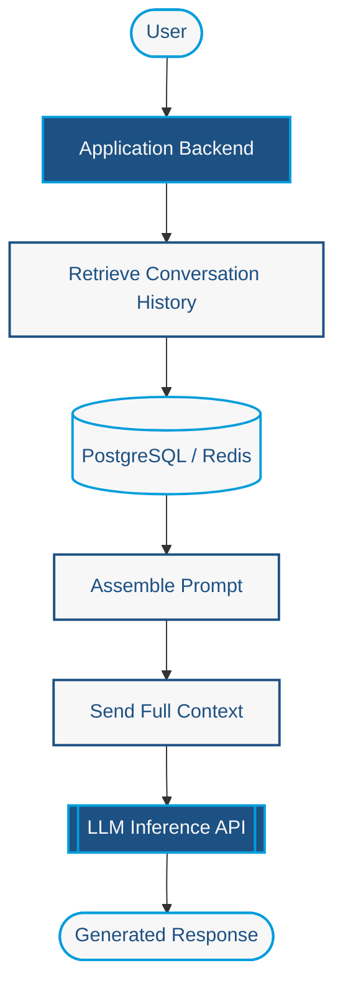

```mermaid
graph TD
    User([User]) --> Backend[Application Backend]
    Backend --> Retrieve[Retrieve Conversation History]
    Retrieve --> DB[(PostgreSQL / Redis)]
    DB --> Assemble[Assemble Prompt]
    Assemble --> Send[Send Full Context]
    Send --> LLM[[LLM Inference API]]
    LLM --> Response([Generated Response])
    
    style User fill:#F8F7F7,stroke:#019DDC,stroke-width:2px,color:#1D5183
    style Backend fill:#1D5183,stroke:#019DDC,stroke-width:2px,color:#F8F7F7
    style Retrieve fill:#F8F7F7,stroke:#1D5183,stroke-width:2px,color:#1D5183
    style DB fill:#F8F7F7,stroke:#019DDC,stroke-width:2px,color:#1D5183
    style Assemble fill:#F8F7F7,stroke:#1D5183,stroke-width:2px,color:#1D5183
    style Send fill:#F8F7F7,stroke:#1D5183,stroke-width:2px,color:#1D5183
    style LLM fill:#1D5183,stroke:#019DDC,stroke-width:2px,color:#F8F7F7
    style Response fill:#F8F7F7,stroke:#019DDC,stroke-width:2px,color:#1D5183
```