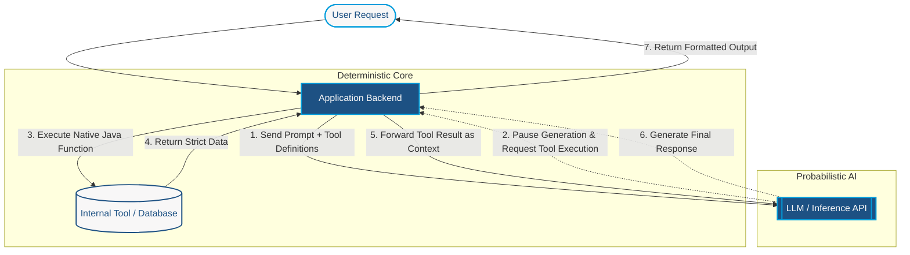

```mermaid
graph TD
    User([User Request]) --> App[Application Backend]
    
    subgraph Probabilistic AI
        LLM[[LLM / Inference API]]
    end
    
    subgraph Deterministic Core
        App
        Tool[(Internal Tool / Database)]
    end

    App -->|1. Send Prompt + Tool Definitions| LLM
    LLM -.->|2. Pause Generation & Request Tool Execution| App
    App -->|3. Execute Native Java Function| Tool
    Tool -->|4. Return Strict Data| App
    App -->|5. Forward Tool Result as Context| LLM
    LLM -.->|6. Generate Final Response| App
    App -->|7. Return Formatted Output| User

    style User fill:#F8F7F7,stroke:#019DDC,stroke-width:2px,color:#1D5183
    style App fill:#1D5183,stroke:#019DDC,stroke-width:2px,color:#F8F7F7
    style LLM fill:#1D5183,stroke:#019DDC,stroke-width:2px,color:#F8F7F7
    style Tool fill:#F8F7F7,stroke:#1D5183,stroke-width:2px,color:#1D5183
```